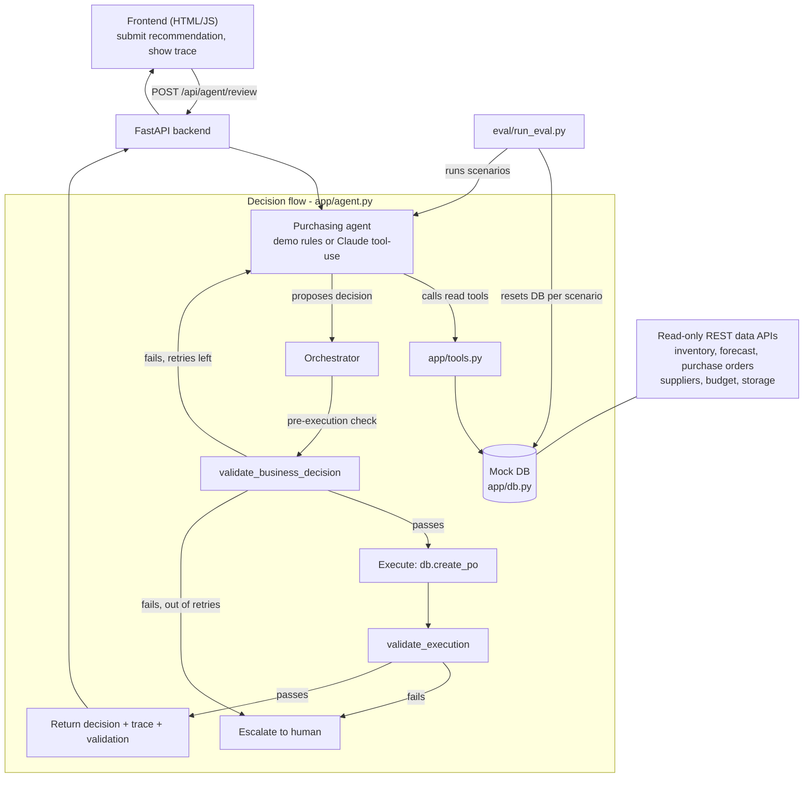

# Rappi AI Purchasing Agent — Scenario 1 (Purchase Recommendation Review)

An AI buyer agent that reviews an upstream purchase recommendation ("buy 800
units"), investigates the real constraints behind it (inventory, forecast,
open POs, supplier terms, budget, storage), and decides whether to
**accept / modify / reject / investigate further** — then executes and
validates that decision, rather than just describing what it thinks.

Requires Python 3.10 or newer.

This implements **Scenario 1 end-to-end**. The design generalizes to
Scenarios 2–4 (see [Beyond Scenario 1](#beyond-scenario-1)).

## Quick start

```bash
# 1. backend
cd backend
python -m venv .venv
# PowerShell on Windows:
.\.venv\Scripts\Activate.ps1
# macOS/Linux: source .venv/bin/activate
pip install -r requirements.txt
Copy-Item ..\.env.example .env   # Windows; works immediately in free demo mode
# macOS/Linux: cp ../.env.example .env
uvicorn app.main:app --reload

# 2. frontend (separate terminal) — any static server works
cd frontend
python -m http.server 5500
# open http://127.0.0.1:5500

# 3. run the evaluation suite (separate terminal)
cd backend
python -m eval.run_eval
```

The project defaults to **free demo mode**, which has no API key, account, or
credit requirement. It uses the same data tools, validation gate, PO execution,
and test scenarios, but applies transparent purchasing rules locally instead
of calling an LLM. This makes the working demo reproducible for any reviewer.

To use a live Claude agent instead, set `AGENT_MODE=anthropic` and provide a
funded `ANTHROPIC_API_KEY` in `backend/.env`.

Run the deterministic guardrail tests with:

```bash
cd backend
python -m unittest discover -s tests -v
```

The backend seeds a default mock dataset on startup (`app/seed_data.py`) so
the demo UI works immediately — no external setup needed. Interactive API
docs are at `http://127.0.0.1:8000/docs`.

## Architecture



**Why a separate orchestrator instead of letting the agent execute its own
action:** the assignment explicitly says the recommendation "should not
necessarily be assumed to be correct" — the same has to be true of the
agent's own output. So the LLM only ever *proposes* a decision via
`submit_decision`; it has no `create_purchase_order` tool. A deterministic
Python function (`validate_business_decision`) independently re-derives the
same numbers from the mock DB and checks hard constraints (budget, storage,
supplier MOQ, coverage sanity). Only if that passes does the system execute
the action. This also gives a clean feedback loop: on failure, the specific
violations are handed back to the LLM so it can revise, instead of the
system silently overriding it or failing outright.

## Approach

**Data model** (`app/models.py`, seeded via `app/db.py`): product, supplier
(lead time, minimum order qty, unit price, reliability), inventory,
demand forecast, open purchase orders, budget, storage capacity — the exact
inputs the assignment lists for Scenario 1.

**Tools available to the agent** (`app/tools.py`), all read-only during
investigation:
- `get_inventory`, `get_demand_forecast`, `get_open_purchase_orders`,
  `get_supplier_terms`, `get_budget_status`, `get_storage_capacity`
- `submit_decision` — the only way the agent can conclude a run

These same read operations are also exposed as plain REST endpoints in
`app/main.py`. PO creation deliberately stays inside the orchestrator, so no
public endpoint can bypass the validation gate.

**Decision loop** (`app/agent.py`): Claude is given the recommendation and
a system prompt telling it explicitly not to trust the recommendation,
to investigate before deciding, and to call `submit_decision` exactly once
per attempt. It can call tools in any order, any number of times (capped at
`MAX_TOOL_TURNS`) before deciding.

**Validation / feedback loop** (`app/validator.py`):
- *Pre-execution* — for `accept`/`modify`: checks the quantity against
  supplier MOQ, remaining budget, remaining storage capacity, and a gross
  overstock sanity check (resulting coverage vs. forecast). For `reject`:
  checks that rejecting doesn't leave the node dangerously under-covered.
  If any check fails, the violations are sent back to the LLM and it gets
  up to `MAX_AGENT_REVISIONS` (default 2) attempts to correct itself.
- *Post-execution* — after a PO is created, it's read back from the DB and
  compared against the intended quantity/supplier/status. This is the
  "does the resulting PO actually look right" check the assignment asks
  for, and it would also catch a broken/partial write in a real system.
- If validation still fails after all revision attempts, or the
  post-execution check fails, the run is **escalated** instead of
  auto-executing a decision the system can't verify. This is also the
  human-approval point: rather than a separate approval queue, "escalate
  instead of act" is achieved via the same feedback mechanism.

**Why this counts as a feedback loop, not just a sanity check:** the
validator's output is fed back into the *same conversation* the LLM is in,
so the LLM sees exactly which constraint it missed and why, and has to
produce a new, reasoned decision — not just a corrected number.

## Test scenarios and evaluation approach

Five scenarios live in `backend/scenarios/*.json`, each a fully self-contained
mock dataset plus an expected outcome:

| Scenario | Setup | Expected decision |
|---|---|---|
| `clean_accept` | Recommendation is reasonable given real coverage gap | `accept` (~800) |
| `already_covered_reject` | On-hand + open PO already exceed forecast | `reject` |
| `storage_constrained_modify` | Real need is large, but storage only fits ~350 units | `modify` (200–350) |
| `budget_constrained_modify` | Storage is fine, but budget only covers ~500 units at this price | `modify` (100–500) |
| `moq_conflict_investigate` | Real gap is ~50 units but supplier MOQ is 500 | `investigate` |

`eval/run_eval.py` resets the mock DB to each scenario's seed, runs the
real agent (real Claude calls, not mocked), and grades each run on:

- **Decision correctness** — did it reach the expected decision (or a
  documented acceptable alternate)?
- **Quantity correctness** — if `accept`/`modify`, is the quantity within
  the expected range?
- **Information-gathering** — did it actually call the read tools rather
  than guessing?
- **Constraint respect** — did the pre-execution validator pass?
- **Correct action** — was a PO created only when expected, and did the
  post-execution validator pass?
- **No unexplained escalation** — a passing run shouldn't need to punt to
  a human.

Run it with:
```bash
cd backend
python -m eval.run_eval
```
This prints a pass/fail line per scenario plus notes, and writes a full
`backend/eval/eval_report.json`. This is deliberately a small, readable
harness rather than a scoring framework — the assignment says a
sophisticated eval framework isn't expected, and for 5 scenarios a plain
"does it match, and why not" report is more useful to a reviewer than an
abstract score.

The deterministic parts (`db.py`, `validator.py`) were also checked directly
against each scenario's expected quantities before wiring in the LLM, to
separate "did the validator's math hold up" from "did the LLM reason well" —
see the git history for that step.

## Beyond Scenario 1

The same agent/tool/validate/execute/escalate pattern extends directly:

- **Scenario 2 (partial fulfillment)** — add a
  `supplier_partial_fulfillment` event and an `investigate_alternate_supplier`
  tool; the same `submit_decision` shape (`source_remaining_elsewhere` /
  `create_backup_po` / `accept_shortfall` / `escalate`) fits the existing
  orchestrator.
- **Scenario 3 (forecast change)** — add a `get_demand_trend`/anomaly tool
  and let the agent compare the *new* forecast against the *existing* PO
  coverage, reusing `validate_business_decision`'s coverage-ratio check
  almost unchanged.
- **Scenario 4 (constraint blocks the buy)** — already partially covered:
  budget/storage constraints already force a `modify`/`investigate` instead
  of blind execution.

These weren't built out to keep the one implemented scenario solid rather
than four shallow ones, per the assignment's guidance that breadth matters
less than depth.

## Repo layout

```
backend/
  app/            FastAPI app, mock DB, tools, agent loop, validator
  scenarios/      5 test scenarios (seed data + expected outcome)
  eval/           evaluation harness
frontend/         static HTML/JS demo UI
.env.example
```

## Limitations / what's mocked

- The "database" is an in-memory Python store (`app/db.py`), reset per
  scenario/run. Swapping it for Postgres/SQLite only touches that one file.
- Budget/storage are simplified to a single number per node; a real system
  would track these per time-bucket.
- No real supplier integration — `get_supplier_terms` reads static seed data.
- No auth on the API; not intended to be internet-facing as-is.
